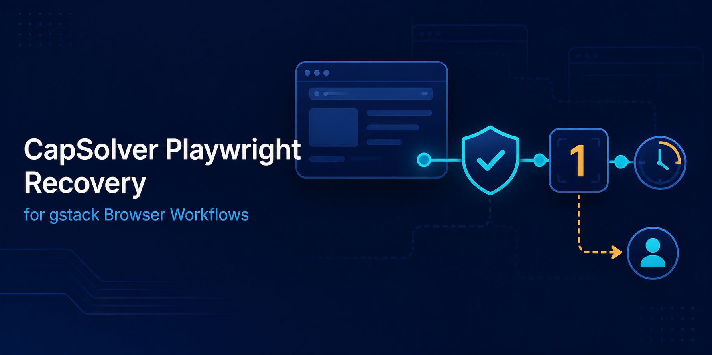

# CapSolver Playwright Recovery for gstack Browser Workflows



[](tests) [](LICENSE)

Add one bounded CAPTCHA recovery decision to an authorized gstack browser workflow, then resume once or hand control to a person.

[English](README.md) · [简体中文](docs/zh-CN/README.md) · [日本語](docs/ja/README.md) · [Español](docs/es/README.md) · [Português](docs/pt-BR/README.md) · [한국어](docs/ko/README.md)

## Introduction

Browser workflows used for owned-site QA or approved automation can stop when a page presents a CAPTCHA checkpoint. This example shows how a Playwright task can detect that state, preserve its goal and authorization context, request one controlled recovery from [CapSolver](https://www.capsolver.com/?utm_source=github&utm_medium=referral&utm_campaign=gstack-capsolver-playwright-recovery&utm_content=repository-readme), and fail safely to a human when any limit is reached.

This is an independent companion for the browser workflow documented by [gstack](https://github.com/garrytan/gstack). It does not modify or fork gstack, expose a gstack plugin API, or claim an official partnership. Its fallback maps to the documented `snapshot`, `handoff`, and `resume` commands.

## Features

- Written-authorization reference and hostname allowlist checked before recovery.
- Task ID, goal, target, purpose, deadline, and attempt budget preserved.
- Timeout, maximum attempts, idempotency, and one-resume protection.
- Live API calls disabled unless `CAPSOLVER_ALLOW_LIVE=1` is explicitly set.
- Deterministic fixtures, nine unit tests, and an offline smoke test.

## How It Works

```text
Playwright task → challenge detected → authorization + host + budget checks
                                           ↓
                               CapSolver recovery request
                                  ↓                  ↓
                            resume once       human handoff → stop
```

No third-party extension interface was found in the verified gstack browser documentation. The helper therefore stays outside gstack and returns a decision to your own Playwright workflow.

## Quick Start

Requires Node.js 20+.

```bash
npm install
npm test
npm run smoke
```

Tests use mock gateways and make no external request. For a real authorized environment, copy `.env.example`, keep the key out of source control, and construct task fields only from the current [CapSolver createTask API contract](https://docs.capsolver.com/en/guide/api-createtask/).

## Usage

```js
import { RecoveryCoordinator, TaskContext } from "./src/index.js";

const context = new TaskContext({
  runId: "qa-run-42",
  targetUrl: "https://qa.example.test/check",
  goal: "verify the owned checkout flow",
  purpose: "authorized regression test",
  authorizationRef: "QA-42",
  allowedHosts: ["qa.example.test"],
  maxAttempts: 1,
  timeoutMs: 15_000
});

const decision = await new RecoveryCoordinator({ gateway }).recover(context);
// Apply a ready result only in target-owner-approved code.
// Otherwise stop and follow decision.handoffCommands.
```

The example in `examples/playwright-companion.js` demonstrates challenge detection through a Playwright `Page`. Page-specific application of a returned solution is deliberately left to the authorized target owner.

## gstack Companion Flow

The verified [gstack browse workflow](https://github.com/garrytan/gstack/blob/main/browse/SKILL.md) supports snapshots plus visible-browser handoff and resume. On a non-ready recovery decision, this helper returns:

```text
snapshot -i -c
handoff
resume
```

Stop after handoff. A person decides whether the workflow may continue, then a fresh snapshot must be taken. Do not invent or depend on an undocumented plugin hook.

## Testing

`npm test` covers context propagation, success, idempotency, hostname mismatch, missing authorization, exhausted budget, provider error, timeout, detector behavior, fallback commands, and default-off live access. `npm run smoke` verifies one authorized success followed by an idempotent replay.

The configuration contracts were verified against current documentation. No real API call or live gstack session was used for this repository.

## API Notes

The optional client uses only the official `createTask` and `getTaskResult` endpoints, bounds polling, and surfaces provider errors. Review the [CapSolver result polling contract](https://docs.capsolver.com/en/guide/api-gettaskresult/) and [CapSolver API error guidance](https://docs.capsolver.com/en/guide/api-error/) before enabling live mode.

## Responsible Use

Use this project only with public data, systems you own, or targets covered by explicit written authorization. Keep the allowlist narrow, attempts fixed, rates reasonable, collection minimal, and a person available for fallback. Never collect credentials or private/restricted data, conceal automation, defeat access controls, or run unlimited collection. For personal, financial, health, employment, or other sensitive data, require purpose-specific authorization, minimization, access controls, audit logs, and a retention schedule; stop when any safeguard is missing.

## Security

Never commit API keys, cookies, browser profiles, captured pages, or production task payloads. See [SECURITY.md](SECURITY.md).

## Conclusion

This repository supplies an auditable Playwright companion for gstack-style browser work: one authorized recovery path, bounded execution, idempotent resume, and an explicit human stop with [CapSolver](https://www.capsolver.com/?utm_source=github&utm_medium=referral&utm_campaign=gstack-capsolver-playwright-recovery&utm_content=repository-readme).

## Maintainer Note

Developer sharing CapSolver integration examples.

## License

[MIT](LICENSE)
